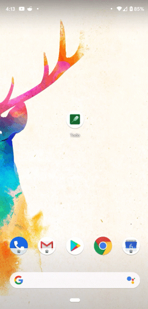
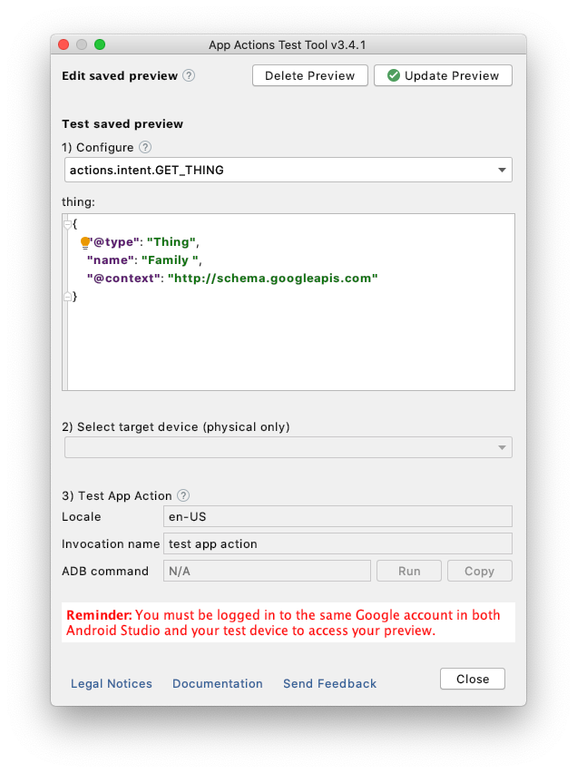

# App Actions to-do list sample

This sample Android app manages items on to-do lists. Users can add items to to-do lists, search for items by category, and view information about completed tasks.

Note: This sample application is a fork of the [Android to-do sample](https://github.com/android/architecture-samples).

By implementing [App Actions](https://developers.google.com/assistant/app/), the app can additionally respond to user queries (voice or text) with the help of Google Assistant.

The app demonstrates usage of the following built-in intents (BIIs) in the common category:

* `actions.intent.OPEN_APP_FEATURE`: Opens a specific feature in the app based on the user query. Here are some example user queries that match this intent:

    * "Open active tasks in test app action"
    * "Open completed tasks in test app action"
    * "Open all tasks in test app action"
    * "Open stats in test app action"

* `actions.intent.GET_THING`: Search and filter within the app using keywords. Here are some example user queries that match this intent:

    * "Search family in test app action"
    * "Look up eggs in test app action"

<div style="text-align:center">
  
</div>

## Beta available

Check out the [App Actions Beta sample](https://github.com/actions-on-google/appactions-common-biis-kotlin/tree/codelab-complete-beta)
that implementes App Actions using the [Android Shortcuts](https://developer.android.com/guide/topics/ui/shortcuts)
framework. This framework integration is in the Beta release stage.

If you're learning how to maintain App Actions implemented using an
[actions.xml](https://developers.google.com/assistant/app/action-schema) resource
file, continue with this sample.

## Requirements

For security and verification reasons, the account you use to upload your `actions.xml` file with the App Actions test tool must have ownership of the application ID.

Additionally, you must meet the setup and usage requirements for [App Actions](https://developers.google.com/assistant/app/get-started#requirements) and for the [App Actions test tool](https://developers.google.com/assistant/app/test-tool#setup_requirements).

## How to use this sample

Clone or download the project to your preferred location. Then, import and modify the project with the following steps:

1. In Android Studio, select **Open an existing Android Studio project** from the initial screen, or go to
   **File > Open**.
2. Change the `applicationId` in [app/build.gradle](app/build.gradle) to the `applicationId` of one of your draft or published apps in the Google Play Console.

    ```groovy
    android {
        defaultConfig {
            // This ID uniquely identifies your app on the device and in Google Play
            applicationId "com.example.myapp"
        }
    }
    ```

3. In Android Studio, find the root directory of the sample.
4. Select the `build.gradle` file.
5. Follow the instructions presented by the IDE.

Then, you can try the App Actions by following these steps:

1. Build and run the sample on your physical test device (**Run "app"**).
2. Open the App Actions test tool (**Tools > App Actions > App Actions Test Tool**).
3. Define an invocation name to use for invoking the App Actions (like "my test app"). This name is only for testing purposes, so it can be different from what you want to deploy to production later.
4. Click **Create Preview**. Once your preview is created, the test tool window updates to display information about BIIs found in your `actions.xml` file.

<div style="text-align:center">
  
</div>

After you create a preview, you can then try using voice or written commands directly with Assistant on your test device.

If you run into any issues, check out the [troubleshooting guide](https://developers.google.com/assistant/app/troubleshoot) in our developer documentation.

## Contribution guidelines

If you want to contribute to this project, be sure to review the
[contribution guidelines](CONTRIBUTING.md).

We use [GitHub issues](https://github.com/actions-on-google/appactions-common-biis-kotlin/issues) for
tracking requests and bugs, please get support by posting your technical questions to
[Stack Overflow](https://stackoverflow.com/questions/tagged/app-actions).

Report [general issues with App Actions features](https://issuetracker.google.com/issues/new?component=617864&template=1257475)
or [make suggestions for additional built-in intents](https://issuetracker.google.com/issues/new?component=617864&template=1261453)
through our public issue tracker.

## References

* [App Actions Overview](https://developers.google.com/assistant/app/overview)
* [Built-in Intents reference](https://developers.google.com/assistant/app/reference/built-in-intents/bii-index)
* [App Actions Test Tool](https://developers.google.com/assistant/app/test-tool)
* [Codelab](https://developers.google.com/assistant/app/codelabs)
* [Other samples](https://developers.google.com/assistant/app/samples)
